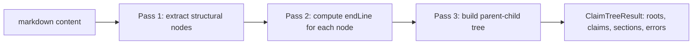
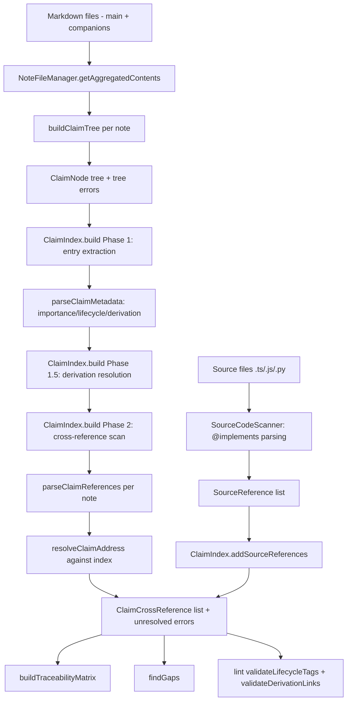

# Claim System Architecture

**Last updated:** 2026-04-30

This document describes how SCEpter's claim system works as a whole — how the dialect authors write becomes a parsed tree, how trees become a queryable index, how references resolve, and how the validation layer catches the failure modes the dialect was designed to prevent. It is grounded in the code at the cited paths and line numbers; the canonical authoring guide lives at `claude/skills/scepter/claims.md` and the requirement notes at `_scepter/notes/reqs/R004`–`R008`.

---

## 1. What a claim is, and what makes the system work

A claim is a statement with an identity that can be referenced from anywhere — another note, a source file, a test. The identity is structural, derived from the position of the claim within a markdown document: a note ID (`R004`), an optional section path (`§3.1`), and a leaf (`AC.01`). Nothing about the claim is stored in a separate registry; the document is the source of truth, and the index is computed.

Three properties make the system load-bearing:

1. **Convention over format.** Claims live in standard markdown headings or paragraph lines. There is no DSL, no required frontmatter per claim, no application layer between the author and the document. LLMs produce and edit the format naturally.
2. **Identity is monotonic and never recycled.** Once `AC.04` exists in `R004.§1`, that ID retires when the claim is removed — its slot is replaced with `[Removed]` text but the heading stays. References from elsewhere remain syntactically valid; the linter flags them as `reference-to-removed`.
3. **Mechanical traceability is the payoff.** Because each claim has a fully qualified ID, source code can carry `@implements {R004.§1.AC.01}`, other notes can carry `{R004.§1.AC.01}`, and the index can compute a matrix showing every projection that touches every claim. Gap detection becomes a matter of presence on this matrix, not human review.

The dialect's rules — alphabetic-only prefixes, single-letter-segment prefixes, mandatory dot — are not stylistic preferences. Each one closes a parser failure mode where authored content silently fails to register as claims, leaving a green-looking trace matrix that is actually empty. The rest of this document explains which mode each rule prevents.

---

## 2. The claim-ID dialect

### 2.1 Grammar shape

A reference, at maximum:

```
NOTE_ID . section_path . CLAIM_PREFIX.number[sub-letter] : metadata
```

| Component | Pattern | Examples |
|-----------|---------|----------|
| Note ID | `[A-Z]{1,5}\d{3,5}` | `R004`, `S012`, `ARCH017` |
| Section path | dot-separated digits, `§` optional | `3`, `§3`, `3.1` |
| Claim ID | letter prefix + dot + 2–3 digits, optional sub-letter | `AC.01`, `SEC.03`, `DC.03a` |
| Metadata | `:`-separated tokens after claim ID | `:4`, `:closed`, `:derives=R005.§1.AC.01` |

Each component is optional except that at least one must be present. From most to least explicit: `R004.§3.AC.01`, `R004.AC.01`, `§3.AC.01`, `AC.01`. Cross-document references are expected to use the fully qualified form; bare claim references resolve only against the current note (see §6).

### 2.2 The hard rules and what each prevents

| Rule | Valid | Invalid | Failure mode if not enforced |
|------|-------|---------|------------------------------|
| Dot is mandatory | `AC.01` | `AC01` (only flagged at line-leading position with 2+ letter prefix) | Letter+digit runs are not distinguishable from arbitrary text — the claim disappears. The linter's heuristic deliberately ignores single-letter labels (`B10`, `H1`) and mid-text occurrences to avoid noise on ordinary spec prose |
| No hyphens | `AC.01` | `AC-01` | Collides with JIRA/issue-tracker syntax common in prose |
| Letter prefix is mandatory | `§3.AC.01` | `§3.01` | Without a prefix, the leaf is indistinguishable from another section level |
| Prefix is alphabetic-only | `AC.01`, `SEC.03` | `PH1.01`, `PRD2.05` | Alphanumeric prefixes overlap the note-ID namespace `[A-Z]{1,5}\d{3,5}`, making `PH1` ambiguous between a 3-char note ID and a claim prefix |
| One letter-prefix segment | `AC.01`, `§1.AC.01` | `FOO.AC.01`, `BAR.AC.01` | A second letter segment has no slot in the grammar — `[A-Z]+\.\d{2,3}` doesn't match, so the parser silently drops the claim and the trace matrix shows zero |
| `§` is for section numbers only | `§3.AC.01` | `§AC.01` | A claim prefix has no positional ambiguity needing `§` emphasis. The parser tolerates the form (hallucination tolerance) but it should not be authored |
| Monotonic, never recycled | sequential | reusing deleted IDs | Existing references would point at unrelated content |

The two non-obvious rules — alphabetic-only prefix and single-letter-segment — exist because both failure modes are silent. Authored content that violates either rule looks correctly structured to a human reader; the regex `[A-Z]+\.\d{2,3}` simply doesn't match it, the index records nothing, and `scepter claims trace` reports "No claims found" without explaining why.

### 2.3 Sub-letters

`AC.03a`, `AC.03b` are valid refinements of `AC.03`. Sub-lettered claims sort between their base and the next integer (`AC.03 < AC.03a < AC.03b < AC.04`). Sub-letters are not supported in range expansion (`AC.01-06`) — see `core/src/parsers/claim/claim-parser.ts:321`.

### 2.4 Metadata suffix

Metadata is colon-separated tokens following the claim ID:

```
AC.01:4                              importance 4
AC.01:closed                         lifecycle closed
AC.01:4:closed                       both
DC.01:derives=R005.§1.AC.01          derivation
DC.01:4:derives=R005.§1.AC.01        importance + derivation
§1.AC.04:superseded=R004.§2.AC.07    lifecycle with target
```

Two parsing positions are accepted: immediately after the claim ID (`§1.AC.01:4 description`) or at end of text (`§1.AC.01 description :4`). See `claim-tree.ts:492-499`.

---

## 3. Recognition surfaces — where claims are found in markdown

The parser recognizes claims in three structural positions. Each is a distinct branch in `buildClaimTree` (`core/src/parsers/claim/claim-tree.ts:205`).

### 3.1 Heading-level claims

A markdown heading whose text starts with a claim or section pattern:

```markdown
### AC.01 The parser MUST extract section IDs.
### DC.01:derives=R005.§1.AC.01 — Derived claim with metadata.
## §3 Section title
```

`HEADING_RE` (`claim-tree.ts:71`) captures the heading level and text. The text is then tested first as a claim (`tryParseClaimText`, `claim-tree.ts:469`) and falling back to a section (`trySectionText`, `claim-tree.ts:521`). Plain headings that match neither are skipped — they have no role in the claim tree but still bound the section structure visually.

### 3.2 Paragraph-level claims

A non-heading line whose first token matches the claim pattern:

```markdown
§1.AC.01 The parser MUST extract section IDs.
DC.01:derives=R005.§1.AC.01 An <AppShell> MUST wrap every route.
**GLYPH.01**: A `GlyphSet` type MUST be defined.
```

Matched by `LINE_CLAIM_RE` (`claim-tree.ts:111`). Bold or italic wrapping (`**AC.01**`) is stripped by `stripInlineFormatting` (`claim-tree.ts:120`) before the regex test. A paragraph claim is treated as a pseudo-heading one level deeper than the most recent heading — `currentHeadingLevel + 1` (`claim-tree.ts:296`) — so the parent-child resolution in pass three lands it under the enclosing section.

### 3.3 Table-row claims (added by `claim-tree.ts:260-286`)

Specs covering many parallel entities frequently use markdown tables to enumerate criteria:

```markdown
| Code  | Criterion                       | Test pattern              |
|-------|---------------------------------|---------------------------|
| AC.01 | Create Foo with required fields | createFoo({id}) succeeds  |
| AC.02 | Reject duplicate Foo id         | Second createFoo throws   |
```

Each non-separator table row is checked: the first cell, after inline-formatting strip, is tested against `CLAIM_ID_RE` (`claim-tree.ts:99`). On match, the claim is registered with the full row content (cells joined by ` | `) as its heading. The row's heading level is inherited from the most recent markdown heading plus one — `currentHeadingLevel + 1` (`claim-tree.ts:280`) — so the claim nests inside the section that contains the table.

`TABLE_ROW_RE` and `TABLE_SEPARATOR_RE` (`claim-tree.ts:74-77`) gate the recognition; the separator row (`|---|---|`) is excluded. The opt-out is an HTML comment anywhere in the document:

```markdown
<!-- no-table-claims -->
```

Detected by `TABLE_CLAIMS_OFF_RE` (`claim-tree.ts:80`), this disables table-row recognition document-wide. Use it when a document has tables that legitimately start with token like `AC.01` but aren't claim definitions (rare, but possible in code-style examples or in documents discussing the dialect itself).

### 3.4 Section heading recognition

Sections require the `§` prefix:

```markdown
## §3 Layout Shell
### §3.1 Sidebar
```

`SECTION_ID_RE` (`claim-tree.ts:86`) matches `§\d+(?:\.\d+)*` at the start of heading text. The `§` is mandatory for section recognition — bare numeric headings (dates, numbered lists, version numbers) do not produce sections. This was a deliberate choice in `R004.§3.AC.01`: bare numbers are too common in prose to safely treat as structural.

### 3.5 Hallucination tolerance

`CLAIM_ID_RE` (`claim-tree.ts:99`) and `LINE_CLAIM_RE` (`claim-tree.ts:111`) include two `§?` groups so that `§AC.01` and `§DC.01` parse as if the stray `§` weren't present. AI agents frequently produce these forms because they over-generalize the section emphasis convention. The parser accepts and discards the `§`; the form is not endorsed and the linter does not surface it, but it parses rather than dropping.

---

## 4. The parser pipeline

`buildClaimTree(content)` (`core/src/parsers/claim/claim-tree.ts:205`) runs three passes over the document:



### 4.1 Pass 1 — structural extraction

Walks every line. For each line:

- If it matches `HEADING_RE`: try claim first, fall back to section. Update `currentHeadingLevel` so that subsequent paragraph claims know their containing scope.
- If it matches `TABLE_ROW_RE` (and table-claims are enabled): test the first cell as a potential claim ID.
- Otherwise, after stripping inline formatting, test against `LINE_CLAIM_RE`. If it doesn't match the valid form but matches `LINE_ALPHANUMERIC_PREFIX_RE` (`claim-tree.ts:161`) or `LINE_MULTI_SEGMENT_PREFIX_RE` (`claim-tree.ts:186`), emit an error rather than silently dropping — the author was clearly trying to define a claim but used a forbidden shape.

Each branch invokes the forbidden-form checks (`checkForbiddenForm`, `checkAlphanumericPrefix`, `checkMultiSegmentPrefix`) inline so errors accumulate as the document is walked rather than being deferred to a separate pass.

### 4.2 Pass 2 — content boundaries

Each structural node gets an `endLine`: the line just before the next node at the same or shallower heading level. If the next node is deeper, the search continues until a sibling or ancestor is found. This is what lets `findContainingClaim` later (`claim-index.ts:641`) resolve "which claim contains line N" for cross-reference attribution.

### 4.3 Pass 3 — parent-child relationships

A stack-based walk over the structural nodes builds the tree by heading level: pop the stack while the top is at the same or deeper level than the current node, attach the current node as a child of the new top (or as a root if empty), push.

The crucial bit: when a claim node has a bare ID (like `AC.01` defined inside a `## §2` section), it's qualified with the ancestor section path: `2.AC.01`. Claims with inline section prefixes (`§1.AC.01` → id `1.AC.01`) are left unchanged because they already encode their position. This is what makes both authoring styles equivalent — `### AC.01` inside `## §2 Title` and `### §2.AC.01` (anywhere) produce the same indexed identity.

**Repeats in the same note are silently dropped.** After qualification, the parser checks whether the claim's (or section's) qualified ID is already registered. If it is, the node is not pushed onto the tree, not added to the maps, and not pushed onto the stack — and no `duplicate` error is emitted. The first occurrence is canonical; subsequent occurrences are treated as prose. This matches the common authoring pattern where a TOC, summary, or appendix at the bottom of a long spec restates earlier claim IDs. The trade-off is that an actual accidental copy-paste duplicate is silently swallowed; the assumption is that authors rarely intend two distinct claims with the same ID and that the noise cost of the prior strict check outweighed the rare-typo benefit.

### 4.4 `validateClaimTree` — second-pass checks

`validateClaimTree(tree)` runs after build to add:

- **Monotonicity** (`checkMonotonicity`): within each section, claims with the same prefix must have increasing `(claimNumber, claimSubLetter)`. Going backward — `AC.05` followed by `AC.03` — produces a `non-monotonic` error. The check is recursive across sections. Repeated IDs are not seen here because the parser already dropped them in pass 3.

The validator does **not** flag bare-id ambiguity at definition time. The fact that `1.AC.01` and `2.AC.01` both exist in one note is normal — that's the payoff of using sections. Ambiguity is a property of unresolved references, not of the definition graph; if it ever matters, it's surfaced when an actual bare reference fails to resolve.

---

## 5. The validation taxonomy

`ClaimTreeError` (`core/src/parsers/claim/claim-tree.ts:56`) defines a closed set of error types. Some are emitted during `buildClaimTree`/`validateClaimTree`; others are emitted during `ClaimIndex.build` after cross-document resolution; others are added by the lint command after consulting the index.

| Type | Where emitted | What it catches |
|------|--------------|-----------------|
| `forbidden-form` | `claim-tree.ts` (`checkForbiddenForm`, `checkAlphanumericPrefix`, `checkMultiSegmentPrefix`) | `AC01` at line-leading position with 2+ letters in the prefix; `PH1.01` (alphanumeric prefix); `FOO.AC.01` (multi-segment prefix). Single-letter labels like `B10`, `H1`, `T1` are not flagged — they are common section/topic codes, not claim attempts |
| `duplicate` | Reserved | The parser drops same-note repeats silently and the index keeps the first-seen entry on FQID collision. The taxonomy retains the type for future use (e.g., a different category of duplicate, or a stricter authoring mode), but no current code path emits it |
| `ambiguous` | Reserved | Originally meant a bare suffix (`AC.01`) appearing in multiple sections of one note. No current code path emits it: bare-id ambiguity is a property of unresolved references, not of definitions, so flagging it at definition time produced noise on every multi-section spec |
| `non-monotonic` | `claim-tree.ts` (`checkMonotonicity`) | `AC.05` followed by `AC.03` within the same section. Repeated IDs do not appear here because the parser drops them before validation |
| `unresolved-reference` | `claim-index.ts` | A `{NOTE.§N.AC.NN}` cross-note reference whose target doesn't exist in the index |
| `multiple-lifecycle` | `cli/commands/claims/lint-command.ts` | A claim carries more than one lifecycle tag (e.g., `:closed:deferred`) |
| `invalid-supersession-target` | `lint-command.ts` | `:superseded=R005.§2.AC.99` where the target does not exist |
| `reference-to-removed` | `lint-command.ts` | A claim is tagged `:removed` but other notes still cross-reference it |
| `unresolvable-derivation-target` | `claim-index.ts` | `:derives=R005.§1.AC.99` where the target cannot be resolved |

The lint command (`lint-command.ts`) also adds derivation-specific errors that aren't in the base taxonomy: `derives-superseded-conflict`, `self-derivation`, `invalid-derivation-target`, `derivation-from-removed`, `derivation-from-superseded`, `circular-derivation`, `deep-derivation-chain` (>2 hops), and `partial-derivation-coverage`. These extend the type union at usage sites because they're computed from index state, not from tree structure.

### 5.1 Why three layers of validation

The taxonomy fans across three layers because each error needs different context:

- **Tree-local errors** (`forbidden-form`, `non-monotonic`) are decidable from the document alone. They run during `buildClaimTree`/`validateClaimTree` and need no other state.
- **Index-level errors** (`unresolved-reference`, `unresolvable-derivation-target`) require cross-document resolution. They emerge during `ClaimIndex.build` once all entries are populated.
- **Lifecycle and derivation errors** (`multiple-lifecycle`, `invalid-supersession-target`, `reference-to-removed`, plus the derivation-specific extensions) require both the index and a per-note check; they live in `lint-command.ts` because the lint command is the only consumer.

A consequence: the lint command rebuilds the index for the project, then walks the requested note's entries with full graph context. `scepter claims index` is implicit; the lint output is the synthesis.

---

## 6. The reference parser

`parseClaimReferences(content, options)` (`core/src/parsers/claim/claim-parser.ts:361`) scans markdown for references — both braced (`{R004.§1.AC.01}`) and braceless (`R004.§1.AC.01` or `AC.01`).

### 6.1 Braced references

`bracedRe` (`claim-parser.ts:374`) matches `{...}` content per line. Each capture is fed to `parseClaimAddress` (`claim-parser.ts:128`), which:

1. Splits off the metadata suffix at the first `:` via `parseMetadataSuffix` (`claim-parser.ts:109`).
2. Validates each dot-separated segment isn't the forbidden `AC01` form (unless it's a valid note ID).
3. Walks segments left-to-right: first a note ID (if it matches `[A-Z]{1,5}\d{3,5}`), then numeric sections, then a `PREFIX.NN` claim pair.
4. Returns a `ClaimAddress` (`claim-parser.ts:31`) with the parsed components.

Braced references always work — they are the unambiguous form. They are recognized regardless of project configuration and regardless of whether the shortcode is registered as a note type.

### 6.2 Braceless references

Controlled by the `bracelessEnabled` option (default `true`). `buildBracelessPatterns` (`claim-parser.ts:512`) returns a list of regex patterns matching distinctive braceless shapes:

1. `§3.AC.01` — `§`-prefixed paths
2. `§AC.01` — `§`-prefixed bare claim
3. `R004.3.AC.01` — note ID + dot path
4. `3.AC.01` — numeric-prefix claim path
5. `AC.01` — bare claim path
6. `R004` — bare note ID (only when `knownShortcodes` is provided)

Each pattern uses negative lookbehind/lookahead to avoid matching inside other tokens. Matches are filtered:

- **Inside braces?** `isInsideBraces` (`claim-parser.ts:497`) skips matches that fall within `{...}` to avoid double-counting braced refs.
- **Adjacent to backticks?** `claim-parser.ts:425-431` skips matches preceded or followed by `` ` `` so inline code (`` `AC.01` ``) is not treated as a reference.
- **Bare note ID?** Requires `knownShortcodes` validation: `R004` is only treated as a reference if `R` is a configured shortcode. This prevents random uppercase+digits strings (e.g. an SKU like `SKU0042`) from being matched.

### 6.3 Range expansion

`parseRangeSuffix` (`claim-parser.ts:242`) detects `AC.01-06` (compact) and `AC.01-AC.06` (explicit), at any qualification level. `expandClaimRange` (`claim-parser.ts:280`) produces individual `ClaimAddress` objects for each number in the range, preserving zero-padding from the source. Sub-letters are not supported in ranges; the start must be less than the end. Both `parseClaimReferences` and the index treat range-expanded references as if they had been written individually.

### 6.4 Why braceless matching needs configuration

Braceless matching is the default because authors write inline references like "as required by R004.§1.AC.01" and braces are visual noise. But it requires a shortcode whitelist to avoid false positives — otherwise any `[A-Z]{1,5}\d{3,5}` string (license plates, version codes, JIRA tickets like `AUTH-42`) would be claimed. The shortcode list is derived from configured note types (`deriveKnownShortcodes`, `claim-index.ts:157`). Note IDs whose shortcode isn't registered fail validation; full claim paths with `PREFIX.NN` are structurally distinctive enough that they don't need shortcode validation.

### 6.5 Section-only references are not cross-references

`§10`, `§3.1`, `§14.5.1` are structural navigation markers — "see section 10 below" — not claim references. `claim-index.ts:381-383` skips parsed addresses whose `claimPrefix` is undefined when building cross-references. Without this guard, a bare section reference like `§10` could fuzzy-match a claim ending in `.10` (e.g., `R004.§1.AC.10`), creating false positives in the trace matrix.

`R004.§4.AC.05` extends this: fuzzy resolution requires the raw reference string to contain `[A-Z]+\.\d{2,3}`. See `claim-index.ts:199-201`. Bare numeric strings like `"10"` or section paths like `"3.1"` cannot fuzzy-match against claim IDs.

---

## 7. The index

`ClaimIndex.build(notes)` (`core/src/claims/claim-index.ts:246`) is the system's central computation. It consumes an array of `NoteWithContent` (id, type, filePath, content) and produces a `ClaimIndexData` with entries keyed by fully qualified ID, trees keyed by note ID, a flat list of cross-references, and an error list.

The build runs in three phases:

### 7.1 Phase 1 — entry extraction (lines 261-324)

For each note: parse the content via `buildClaimTree`, validate it via `validateClaimTree`, store the tree, and walk it to collect every claim node. Each claim becomes a `ClaimIndexEntry` (`claim-index.ts:51`):

```typescript
{
  noteId, claimId, fullyQualified,    // R004.3.AC.01
  sectionPath, claimPrefix, claimNumber, claimSubLetter,
  heading, line, endLine,
  metadata,                            // raw colon-suffix tokens
  importance, lifecycle, parsedTags,   // interpreted from metadata
  derivedFrom,                         // raw targets, resolved in Phase 1.5
  noteType, noteFilePath
}
```

Metadata interpretation happens via `parseClaimMetadata` (`claims/claim-metadata.ts:125`), which classifies each raw token:

1. Bare digit 1–5 → importance (first wins).
2. `derives=TARGET` → `derivedFrom[]`. Checked **before** lifecycle so it doesn't get swallowed by the lifecycle branch.
3. Lifecycle keyword (`closed`, `deferred`, `removed`, or `superseded=TARGET`) → lifecycle (first wins; subsequent are ignored, with `multiple-lifecycle` raised separately by lint).
4. Anything else → freeform tag.

If the same fully qualified ID arrives from two different notes, the index keeps the first one seen and ignores subsequent ones — no error. Note IDs are assumed unique elsewhere in the system, so this branch is mostly defensive.

### 7.2 Phase 1.5 — derivation resolution (lines 326-362)

After all entries exist, walk each entry's `derivedFrom` and resolve each raw target to a fully qualified ID via `resolveClaimAddress` (`claim-index.ts:175`). Build the reverse `derivativesMap` keyed on source FQID, valued with the array of derived FQIDs.

This phase is separate from Phase 1 because a derived claim in `DD003` may reference a source claim in `R005`, and if resolution ran during entry creation, `R005`'s entries might not exist yet. Unresolvable targets produce `unresolvable-derivation-target` errors. Resolved targets replace the raw strings on `entry.derivedFrom`.

### 7.3 Phase 2 — cross-reference scanning (lines 364-450)

For each note, run `parseClaimReferences` on the content. For each reference:

1. Skip section-only references (no `claimPrefix`).
2. Build the raw reference string and resolve it via `resolveClaimAddress`.
3. If resolved and the target is in a different note, find the containing claim in the source note (`findContainingClaim`, `claim-index.ts:641`) and record a `ClaimCrossReference`.
4. If unresolved and the reference targets a different note (cross-document refs only), emit an `unresolved-reference` error and create a placeholder cross-reference with `unresolved: true` so the trace command can surface it instead of dropping it.

Self-references (a claim referencing itself within its own note) are skipped — they are structural rather than informational.

### 7.4 `addSourceReferences` — the source projection

`ClaimIndex.addSourceReferences(refs)` (`claim-index.ts:531`) is called separately, after `build`, by the project initialization code. It consumes `SourceReference` objects produced by `SourceCodeScanner` parsing `@implements`, `@validates`, `@depends-on`, etc. annotations. For each ref with a `claimPath`, it normalizes the path, builds the FQID, looks up the target entry, and records a cross-reference whose `fromNoteId` is `source:filename.ts` and whose entry in `noteTypes` is `Source`.

This is why the trace matrix's "Source" column works: source files are first-class projection participants, registered in `noteTypes` like any other note. The trace logic doesn't distinguish source from notes — it sees only the cross-reference graph.

### 7.5 Resolution semantics in `resolveClaimAddress`

`resolveClaimAddress` (`claim-index.ts:175`) tries three strategies in order:

1. **Exact match** on the raw string (already a fully qualified ID).
2. **Prefix with current note ID** (`AC.01` inside R004 → try `R004.AC.01`).
3. **Suffix match scoped to the current note**: only entries whose key starts with `currentNoteId + '.'` and ends with `.raw`. The scoping is what prevents bare references like `AC.01` from accidentally matching some other note's `AC.01`. Cross-note bare references are not supported — they must include the note ID explicitly.

The fuzzy strategy is gated by the `[A-Z]+\.\d{2,3}` pattern (claim-index.ts:199) so that bare numeric strings like `"10"` cannot resolve.

---

## 8. Lifecycle, importance, and derivation

The metadata system has four orthogonal axes, each interpreted from colon-suffix tokens by `parseClaimMetadata` (`core/src/claims/claim-metadata.ts:125`).

### 8.1 Importance (`R005.§1`)

A bare digit 1–5 sets `importance`. The scale is ordinal — 5 means most important. Importance is optional; absence is not "importance 0", it is no signal. Digits outside 1–5 fall through to freeform tags. First wins if multiple are present.

`scepter claims trace --importance 4` filters; `--sort importance` orders. High-importance claims are visually distinguished in default output.

### 8.2 Lifecycle (`R005.§2`)

Four mutually exclusive states:

| Tag | Meaning | Effect on gap reports |
|-----|---------|----------------------|
| `:closed` | Gap resolved | Excluded by default (`--include-closed` to show) |
| `:deferred` | Intentionally postponed | Excluded by default (`--include-deferred` to show) |
| `:removed` | Claim retired; ID not reused | Excluded; `reference-to-removed` warning if still referenced |
| `:superseded=TARGET` | Replaced by another claim | Excluded; `invalid-supersession-target` if TARGET doesn't exist |

`isLifecycleTag` (`claim-metadata.ts:77`) recognizes the four keywords plus the `superseded=` prefix form. Multiple lifecycle tags on one claim is an error caught by `validateLifecycleTags` in lint, not by the parser (which silently keeps the first).

When a claim is `:removed`, the convention is to replace its body with `[Removed]` while keeping the heading. The ID slot stays occupied (preventing reuse and preserving downstream reference parseability) but the claim text is empty so readers don't evaluate dead requirements.

### 8.3 Derivation (`R006`)

`derives=TARGET` declares that the current claim is a decomposition of TARGET. Multiple `derives=` entries are allowed — a claim may derive from several sources (`R006.§1.AC.02`). The check against derivation tags happens before the lifecycle check (`claim-metadata.ts:149`) so `derives=` doesn't get treated as a freeform tag and can coexist with lifecycle tags (`DC.01:derives=R005.§1.AC.01:closed`).

`derives=TARGET` and `superseded=TARGET` are mutually exclusive — one is "I came from X", the other is "I was replaced by X". The lint check `derives-superseded-conflict` (`lint-command.ts:223`) catches simultaneous use.

The index resolves derivation targets in Phase 1.5 (§7.2) and exposes both directions:

- `getDerivedFrom(claimId)` — sources this claim derives from.
- `getDerivatives(claimId)` — derived claims that point at this one.

The traceability matrix uses derivation as a projection edge: if a DC in DD003 declares `derives=R005.§1.AC.01`, R005's trace shows a Design column entry pointing at DD003 (`traceability.ts:217-234`), even if DD003 has no inline `{R005.§1.AC.01}` reference. Derivation is a first-class projection signal.

Lint extends this with eight derivation-specific checks (`lint-command.ts:208-345`):

- `invalid-derivation-target` — target unresolvable.
- `self-derivation` — claim derives from itself.
- `circular-derivation` — chain cycles.
- `deep-derivation-chain` — chain >2 hops (warning).
- `derives-superseded-conflict` — both metadata kinds.
- `derivation-from-removed` — target is `:removed`.
- `derivation-from-superseded` — target is `:superseded` (suggest re-deriving from replacement).
- `partial-derivation-coverage` — source has derivatives, but only some have Source coverage.

### 8.4 Why "inline for identity, sidecar for judgment"

R005's design principle (line 30): properties that change what the claim IS belong inline (importance, lifecycle, derivation). Properties that record the project's relationship to the claim — when it was verified, by whom, with what method — go into `_scepter/verification.json`, an append-only event store managed by `claims/verification-store.ts`. A claim's identity should be readable from its document text alone; verification history is a separate read.

---

## 9. Folder-note aggregation

A folder-based note (`R001 Title/R001.md` plus companion `.md` files in the same directory) is treated as one logical document for claim purposes. The mechanism is `NoteFileManager.getAggregatedContents(noteId)` (`core/src/notes/note-file-manager.ts:189`):

1. Look up the main file path from the in-memory note index.
2. Detect folder-note layout: parent directory name starts with `noteId`.
3. If not a folder note, return the main file content unchanged.
4. Otherwise, list companion `.md` files via `scanFolderContents`, sort alphabetically (for determinism), and concatenate their bodies onto the main file's content with `\n\n` separators.
5. Strip frontmatter from each companion via `gray-matter` so only the main file's frontmatter survives.

Consumers that need claim-level treatment of a folder note call this method instead of `getFileContents`. `lint-command.ts:43` is the explicit example. The claim index uses aggregated content when building entries for folder notes (the project initialization code feeds `note.content` from this method into `ClaimIndex.build`).

Consequences for authoring:

- Sub-files share a single ID namespace. The aggregated content is treated as one note, so a `§3` in `01-core.md` and another `§3` in `02-extensions.md` resolve as same-note repeats: the parser keeps the first occurrence and silently drops the second. Authors who need both should rename one section.
- Companion files are concatenated in alphabetical order. Authors control logical sequence via filename (`01-core.md`, `02-extensions.md`).
- Companion frontmatter is discarded — only the main file's frontmatter is authoritative.
- Sub-files are not independently referenceable. `{R001/details.md}` is not syntax. `{R001}` references the folder note as a whole.

This is what makes long, multi-file notes practical without sacrificing claim-level addressability — a single requirement document can grow across files, and authors continue to write `§3.AC.04` without caring which sub-file it lives in.

---

## 10. How the layers compose



The transition points are the load-bearing seams:

- **Markdown to tree**: `buildClaimTree` is the only place where text becomes structure. Anything that wants to know "what claims does this file define" calls it. Folder-note aggregation must happen before this seam.
- **Tree to index**: `ClaimIndex.build` is where per-note trees become a project-wide queryable graph. Cross-document concerns (duplicate FQIDs, derivation resolution, cross-references) live here and not earlier.
- **Index to consumer**: trace, gaps, search, thread, stale, and lint are all readers of `ClaimIndexData`. None of them re-parses; they consult the index. Lint adds derivation- and lifecycle-specific checks that need the graph to evaluate.

---

## 11. Why the rules look the way they do

A few rules in the dialect look arbitrary but are forced by the parser shape. Documenting the rationale reduces the chance an editor "fixes" them later.

### 11.1 Why alphabetic-only prefixes

The note-ID namespace is `[A-Z]{1,5}\d{3,5}`. If a claim prefix could include digits, then `PH1.01` would be ambiguous: is `PH1` a 3-character note ID followed by section 01, or a claim prefix followed by claim number 01? The two namespaces would overlap, and any disambiguation rule would be fragile under future growth (longer note ID prefixes, longer claim numbers). The alphabetic-only restriction makes the namespaces structurally disjoint. The linter's `forbidden-form` error includes the suggested fix — strip the digits (`PH.01`), or pick a different shape.

### 11.2 Why one letter-prefix segment

A claim ID slot in the grammar is `[A-Z]+\.\d{2,3}`. There is no second slot for a letter segment. `FOO.AC.01` has two letter segments before the number: `FOO` and `AC`. Neither matches the slot — `FOO` lacks the trailing `.\d{2,3}`, and `AC.01` is preceded by `FOO.` which the parser interprets as part of a path. So the parser silently produces no claim node.

The failure is silent. A document full of `FOO.AC.01`, `BAR.AC.01`, `BAZ.SEC.03` looks well-structured to a human; `scepter claims trace` reports zero claims; `scepter claims gaps` is silent. The author has no signal that anything is wrong.

The rule prevents this by detecting the shape and emitting `forbidden-form` with a diagnostic that explains both fixes:

(a) Use sections for entity scope: `## §1 Foo` containing `AC.01` (resolves to `S001.§1.AC.01`).
(b) Flatten to a single namespacing prefix: `FOO.01`, `BAR.01` (resolves to `S001.FOO.01`).

The choice between (a) and (b) depends on which axis matters more — the entity, or the AC/SEC/PERF distinction. Both cannot be encoded in one ID; that's the point.

### 11.3 Why the `:` separator and not commas

Earlier syntax (R004.§2.AC.04) used `:P0,security` with comma separation. R005.§2.AC.04a superseded this with colon separation (`:4:closed:derives=R005.§1.AC.01`) so that key-value items containing commas (`derives=TARGET` where TARGET could in principle be a list, though current syntax doesn't permit it) wouldn't conflict, and so that the separator was uniform. Inside a single metadata item, `=` binds key to value; `:` separates items.

### 11.4 Why braceless matching is opt-in for note IDs only

A standalone uppercase+digits string is too easy to find in random text — model numbers, license plates, JIRA tickets. Making braceless note-ID matching contingent on the shortcode being configured (via `knownShortcodes`) eliminates false positives without forcing authors to brace every note reference. Claim paths (`AC.01`, `R004.§1.AC.01`) are structurally distinctive — the dot-and-digit pattern is rare in prose — so they don't need the shortcode gate.

---

## 12. CLI surface (where the lints run)

The commands that consume the index live in `core/src/cli/commands/claims/`:

- `index-command.ts` — build the index, report errors.
- `lint-command.ts` — per-note structural and lifecycle/derivation validation.
- `trace-command.ts` — traceability matrix.
- `gaps-command.ts` — claims with partial projection coverage.
- `thread-command.ts` — derivation tree from a claim.
- `search-command.ts` — text and structural search.
- `verify-command.ts` — append a verification event.
- `stale-command.ts` — staleness detection from verification dates.

`ensure-index.ts` is the shared entry point that calls `ProjectManager.initialize()` and returns built `ClaimIndexData`. Consumer commands do not rebuild on each invocation unless `--reindex` is passed.

The lint command is where the most enrichment happens. Beyond the tree-level errors, it computes:

- Lifecycle errors (`validateLifecycleTags`): multiple lifecycle tags, invalid supersession target, references to removed claims.
- Derivation errors (`validateDerivationLinks`): the eight derivation-specific checks listed in §8.3.

The errors are merged with tree errors, deduplicated by `(line, type)`, and rendered. JSON output is available for tooling.

---

## 13. Reading order for new contributors

If you are touching the claim system, this is the read order that minimizes wasted effort:

1. `claude/skills/scepter/claims.md` — the user-facing dialect and authoring discipline. Read in full before anything else.
2. `_scepter/notes/reqs/R004 Claim-Level Addressability and Traceability System.md` — the canonical requirement, especially §1 (syntax) and §3 (heading-based definition).
3. `core/src/parsers/claim/claim-tree.ts` — the parser. Start with the regex constants (lines 71–189) and `buildClaimTree` (line 205).
4. `core/src/parsers/claim/claim-parser.ts` — reference parsing. Start with `parseClaimAddress` (line 128) and `parseClaimReferences` (line 361).
5. `core/src/claims/claim-metadata.ts` — metadata interpretation in full (the file is short).
6. `core/src/claims/claim-index.ts` — the index, especially `build` (line 246) and `resolveClaimAddress` (line 175).
7. `core/src/claims/traceability.ts` — how the matrix is computed from the index.
8. `core/src/cli/commands/claims/lint-command.ts` — where the lifecycle and derivation extensions live.
9. `_scepter/notes/reqs/R005`, `R006`, `R008` — for the specific subsystems (metadata, derivation, folder aggregation).

The tests under `core/src/parsers/claim/__tests__/` and `core/src/claims/__tests__/` are the most reliable way to verify behavior changes; they exercise the dialect's edge cases concretely.
